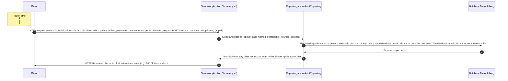

```mermaid
sequenceDiagram
  participant C as Client
  participant A as Sinatra Application Class (app.rb)
  participant R as Repository class ArtistRepository
  participant D as Database Music Library
  Note left of C: Flow of time <br /> ⬇ <br /> ⬇ <br /> ⬇ 
  autonumber
  C->>A: HTTP Request method is POST, address is http://localhost:9292, path is /artists, parameters are name and genre. Forwards request POST /artists to the Sinatra Applicating (app.rb) 
  A->>R: Sinatra Applicating (app.rb) calls method create(artist) in ArtistRepository
  R->>D: The ArtistRepository class creates a new artist and runs a SQL query to the database 'music_library' to store the new artist. The database 'music_library' stores the new artist
  D->>R: Returns response
  R->>A: The ArtistRepository class returns an Artist to the Sinatra Application Class.
  A->>C: HTTP Response: the route block returns response (e.g. '200 0k') to the client.
```

