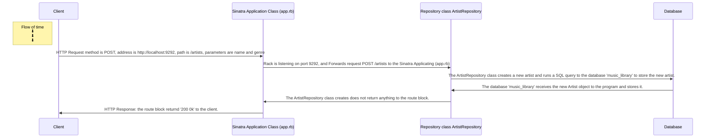

```mermaid
sequenceDiagram
  participant C as Client
  participant A as Sinatra Application Class (app.rb)
  participant R as Repository class ArtistRepository
  participant D as Database
  Note left of C: Flow of time <br /> ⬇ <br /> ⬇ <br /> ⬇ 
  C->>A: HTTP Request method is POST, address is http://localhost:9292, path is /artists, parameters are name and genre 
  A->>R: Rack is listening on port 9292, and Forwards request POST /artists to the Sinatra Applicating (app.rb)
  R->>D: The ArtistRepository class creates a new artist and runs a SQL query to the database 'music_library' to store the new artist. 
  D->>R: The database 'music_library' receives the new Artist object to the program and stores it.
  R->>A: The ArtistRepository class creates does not return anything to the route block.
  A->>C: HTTP Response: the route block returnd '200 0k' to the client.
```

